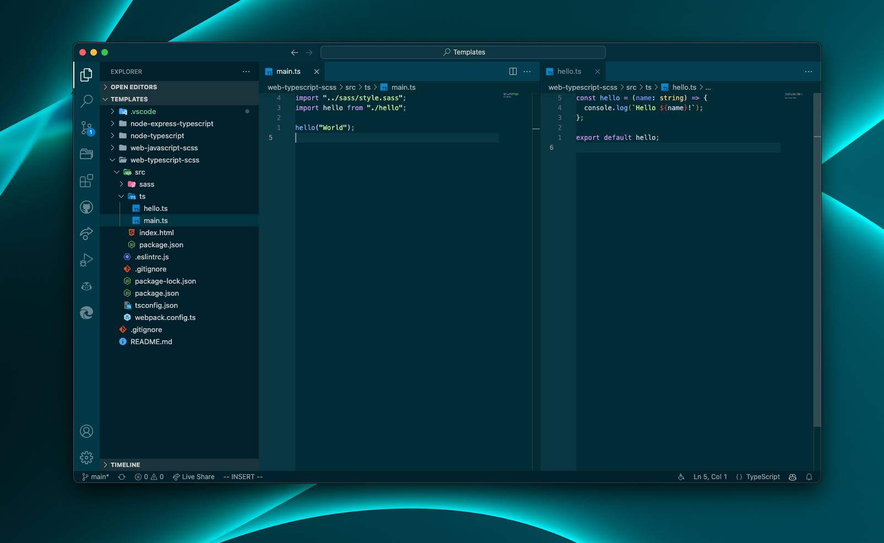

# Solarized Palenight

Solarized Palenight is a dark theme for Visual Studio Code. It's based on the [Solarized Dark](https://marketplace.visualstudio.com/items?itemName=ryanolsonx.solarized) theme by Ryan Olson and the [Palenight Theme](https://marketplace.visualstudio.com/items?itemName=whizkydee.material-palenight-theme) by Olaolu Olawuyi.

The reason I created this theme is because I wanted to use the Solarized Dark theme, but I didn't like the fading/subtle syntax highlighting but I loved the fun syntax highlighting of palenight. So, I decided to combine the two themes and create a new one.

